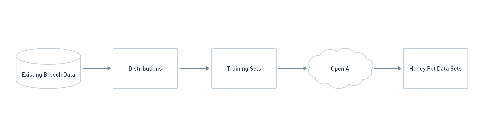

# PROJECT DETAILS
Project Members: 
- Derek Burgess
- Lu Zhu

Email: contact@partialtransformations.com
Phone: +1 412 417 9435
URL: partialtransformations.com

# SUMMARY
A toolset/framework for creating honeypot datasets.  Teams would maintain this as a component of their CI/CD and/or IT Security Tooling. We will leverage the OpenAI API to help analyze datasets and create distributions that can be use to generate these honey pots.

# HYPOTHESES
Blue Teams could buy themsevles time or completely trick attackers by deploying honeypot data sets. Blue Teams could achieve this by deploying an internal toolset that ingests breech data to increase the perceieved value and the raise the level of deception, or "realisticness" of the honey pot.

# APPROACH
We will begin by collecting various existing data sets from known security breeches. Many of these are readibly available in places like GitHub and Pastebin. We will process these data sets through a combination of OpenAI API and statics tooling to produce an array of distrubtions that represent the traits that make up realistic looking data sets. From here, we will ingest these transformed data sets and produce tailored Honey Pot data sets for placement within an defenders infrastrcutre.

## DIAGRAM

## USE OF OPEN AI
Catagorize and label existing data sets and assit in the generation of honey pots.

# TIMELINE AND BUDGET
## Please describe how the funds will be used for your project, and outline how you arrived at the value *
If we use GPT4, at the current cost per 1000/tokens- if we ingest breeched data sets that look roughly like 2 billion tokens (~75 columns x 20-30 million records on average), then we would need ~$120,000 per data set to process it through the OpenAI API. If we use GPT3.5-turbo, at the current cost per 1000/tokens, we can bring the cost down to $4000 per data set.

We would approach this by not ingesting large data sets each time, but instead reviewing data set scheme and testing smaller chunks of data sets to determine viabiliy and furth reduce the overall cost.

Aside from using OpenAI credits for the API usecases describe above. We will also need funding to spin up infrastructure that mimics a traditional defenders "Environment", and demonstrate how this toolset can be used in practice by provide examples and documentation that would support licensing or public release.

Therefore we estimate that we would need roughly $25,000 to cover the costs of processing up to 5 large data sets and the infrastructure to test the hypothesis.

## Please provide a roadmap for the project on a one year time horizon*

# THE TEAM
## Derek Burgess
With 15 years of experience across IT. Derek leads clients through the challenges of digital transformation concerning data, privacy, and security. Having worked a wide range of relevant roles across; Help Desk, Product Design, Product Management, and Engineering, Derek has always pushed to introduce more data-driven techniques to those practices, while partnering across disciplines to design tooling and automation that empower teams to become more data-driven.

## WHY US
Derek and Lu first met working together on an internal tool that analyzed real time data from manufacutirng facilities and provided real time scheduling & production insights back to operators, managers, and other automation tools up/down stream.

For Derek, he has always had an interest in Cybersecurity and even prior to the current advent of Consumer AI, has been part of the Pwnagotchi/Bettercap communities, as well as endevors to create distributed ML processing of WPA encryption. He currently also consults for Fueled, a digital agency, where he guides clients through data/analytics strategy and implementations.