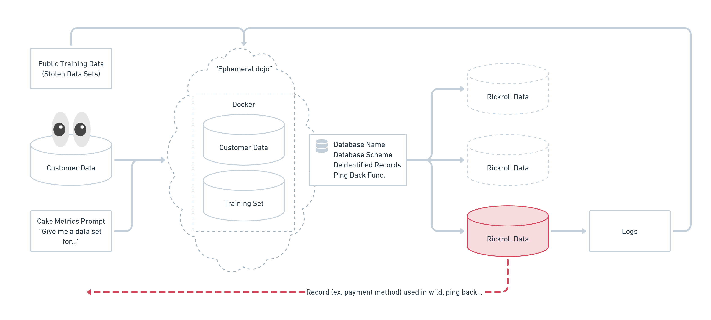

# PROJECT DETAILS
Project Lead: Derek Burgess

Email: contact@derekburgess.com

Phone: +1 412 417 9435

URL: partialtransformations.com

Project Member: Lu Zhu

Role: CTO

Email:

# SUMMARY
A toolset/framework for creating honeypot datasets (or, "rickroll data models") and environments. Think Marauder , but for Blue Teams. The basic idea would be to maintain this as a component of CI/CD and Sec, or deploy during an event to create confusion for attackers by misdirecting them to log-noisy, but high value looking network assets/data sets.

# THE TEAM
## Derek Burgess
With 15 years of experience across IT. Derek leads clients through the challenges of digital transformation concerning data, privacy, and security. Having worked a wide range of relevant roles across; Help Desk, Product Design, Product Management, and Engineering, Derek has always pushed to introduce more data-driven techniques to those practices, while partnering across disciplines to design tooling and automation that empower teams to become more data-driven.

## WHY US
Derek and Lu first me working together on an internal tool that analyzed real time data from manufacutirng facilities and provided real time scheduling & production insights back to operators, managers, and other automation tools up/down stream.

For Derek, he has always had an interest in Cybersecurity and even prior to the current advent of Consumer AI, was part of the Pwnagotchi/Bettercap communities, as well as endevors to create distributed ML processing of WPA encryption. He currently also consults for Fueled, a digital transformation agency, where he guides clients through data/analytics implementations.

# APPROACH
A couple of thoughts from Derek:
- I would like to avoid creating a "training set" from their existing data and resulting in a duplicate set, ie duplicate risk.
- The way marauder works, it does not use AI/ML, it is a straight duplicate of network names... for this project, straight duplicates or even jumbled duplicates, would be of no value.
- To me, the goal would be to ingest and use an emphemeral training set, and even I accept that we will run into limits around training and output.
- How do we best verify the output dataset does not contain any false negatives, i.e. the AI just spit out a random dupe? or lazyily mixed two records together.
- Typical high-value data fields; PII, Names, Addresses, Contact Details, Payment Methods, Private Content.
- The private content one is interesting because we could also explore a honeypot "juice-content", that literally contains the code to change dynamically once copied or moved.
- While listing these out- It made me think- what if Blue Teams employed more reverse red team tactics? To a degree this is a Purple Team- but how many of these actually exist in practice?
- Lastly, do we deploy a reinforcement approach to enhance the output based on real attack data?

# GENERAL REQUIREMENTS/HYPOTHESES
Area to break down some of the big challenges and how we plan to tactle them. For example, how will we QA that none of the rows generated are lazy duplicates of real data?

## PRIOR RESEARCH
Some "prior research", not all related, but may help think out side of the box...
- https://arxiv.org/abs/2009.11208
- https://www.hindawi.com/journals/scn/2020/8865474/
- https://www.hindawi.com/journals/scn/2019/2627608/
- https://www.rapid7.com/blog/post/2016/02/29/the-yellow-brick-road-to-machine-learning-with-honeypot-data-our-lessons-learned/

## USE OF OPEN AI
- They ask specifically if we need/will use OpenAI credits. Can we make this work some how? Im sure there is a bias there.

# TIMELINE AND BUDGET
Current milestones?
- Setup test environment, including "training set" or base "user-data" set to work from. Maybe we could use an existing "stolen" and "dumped" dataset?
- Other test environment needs: dbt, aws/snowflake? openai? Some basic Red Team/Blue Team tooling, probably just a kali box that we attack our environment and test enumeration and exfiltration of the honeypot.
- I guess after this is all setup, we just need to test and iterate until we think we can or cannot achieve the desired outcome.