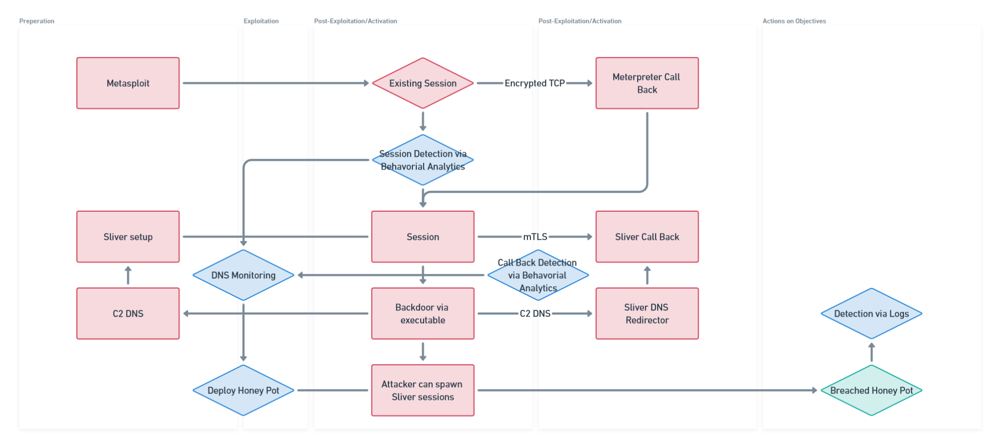

# PROJECT DETAILS
Project Members: 
- Derek Burgess
- Lu Zhu

Email: contact@partialtransformations.com

URL: partialtransformations.com

# SUMMARY
Cake Metrics is a toolset/framework for creating honeypot data sets. Blue Teams would maintain this as a component of their CI/CD and/or IT Security Tooling. We will explore the best methods for extracting traits from existing data sets for the creation of training sets that can be fine-tuned by OpenAI to increase the deception of the honeypot. Additionally, the potential to increase deception through the use of AI has other use-cases, like obfuscation, which we intend to explore further down the road.

# HYPOTHESES
The concept of a honeypot within the context of Cybersecurity is not new, however, because the cost of creating sudo-realistic honeypots has been high, honeypots have rarely see serious deployment- We posit that ML/AI could be applied for the creation of training data, PII, as well as the final honeypot data sets(databases), reducing the resources (time & cost), and increasing the level of deception.  Blue Teams could buy themselves time or trick attackers by deploying realistic AI generated honeypot data bases to production, while silently observing activity.

## QUESTIONS WE SEEK TO ANSWER
- Can we create training sets from existing data, and what risks come with that?
- Can we create training sets from distributions assisted by OpenAI?
- Can we generate realistic looking honeypots from our training sets and OpenAI?
- Which training sets perform better at generating realistic Honeypots?
- Where in a defender's system does this tool best live?
- What alternative use-cases exist?
- Can an attacker use honeypots against the defense?
- How can we validate real data from a realistic honeypot?
- Can we obfuscate data sets using honeypots?

# APPROACH
At first we would like to attempt to collect various existing data sets from known security breaches. We plan to process these data sets through a combination of OpenAI API and statistics tooling to produce an array of distributions that represent the traits that make up realistic looking data sets. From here, we will ingest these transformed data sets and produce Honeypot data sets for placement within an defender's infrastructure.

Updated Commentary:
We initially believed we could approach this entirely using breached datasets. Initial research suggests that we can leverage these, but there may not be enough useful examples to build a training set from. After exploring OSINT tools and building a simple Port Scanner- it dawned on me that we could approach the problem through the lens of OSINT by reverse engineering open API's through their open documentation and scanning techniques.

Strategies for creating this data set:
- Public examples of database schemas which have been shared willingly. An example would be a dev blog where the development team has exposed some of their schema.
- Public examples of database schemas which have been shared unwillingly. An example would be a breached data set, left in a public space.
- Scrape API documentation and rebuild database schema from model definitions.
- Rebuild database schemas from API activity collected using tools like Burp.

## DIAGRAM

## NON BREACH DATA
Using breach data, even if left in a public place like Pastebin, is still a huge risk and could be considered unethical by many. A longer but purely AI based approach could be to isolate the traits as individual efforts and create data sets for each- Working with OpenAI, each trait could be developed to a point that when combined into a final data set, looks like a realistic database.

## DIAGRAM

## USE OF OPEN AI
Initially we plan to leverage OpenAI to help categorize and label existing data sets and eventually assist in the generation of the final honeypots. 

Additionally, we intend to explore how the use of OpenAI could amplify our results in two areas:
- Fine-tuning using our schema training set to generate honeypot schemas.
- Generation of realistic looking PII to complete the honeypot dataset.

We also believe that OpenAI could remain part of the toolset. As we intend to provide defenders with the tooling and documentation to spin this service up and create their own tailored honeypots, a stable AI API would be beneficial to that cause.

## TESTING ENVIRONMENT
We will seek to create a simplified but realistic testing environment modeled on Blue Team principals. We will use discrete methods of capturing logs to demonstrate how an attacker would interact with the honeypot and leave behind evidence of that activity. We would also like to open the test environment to public attack for the purpose of improving on the honeypots and the infrastructure. We have not specified in the diagram below how we intend to implement our solution against the CI/CD pipeline and that is because we are reserving time during our testing to identify where and how this toolset can be injected into infrastructure.

## DIAGRAM

We will initially start by emulating a similar attack chain to this common approach. In turn, deploying Blue Team tooling in places to gather data and improve on the application and realistic-ness of the Honeypot.

# TIMELINE AND BUDGET
## Please describe how the funds will be used for your project, and outline how you arrived at the value *
If we use GPT4, at the current cost per 1000/tokens- if we ingest data sets that look roughly like 2 billion tokens (~75 columns x 20-30 million records on average), then we would need ~$120,000 per data set to process it through the OpenAI API. If we use GPT3.5-turbo, at the current cost per 1000/tokens, we can bring the cost down to $4000 per data set.

We would approach this by not ingesting large data sets each time, but instead reviewing data set scheme and testing smaller chunks of data sets to determine viability and further reduce the overall cost.

Aside from using OpenAI credits for the use cases describe above, we will also need funding to spin up infrastructure that mimics a traditional defenders "Environment". This will help us validate the approach and demonstrate how this toolset can be used in practice by provide examples and documentation that would support licensing or public release.

Therefore we estimate that we would need roughly $25,000 -- $20,000 of which could be OpenAI credits, to cover the costs of processing up to 5 large data sets using GPT3.5-turbo and $5000 to cover the cost of the setup/maintenance of our testing infrastructure (~$1,000 upfront with variable cloud costs).

## Please provide a roadmap for the project on a one year time horizon*
We intend to use 1 month to setup infrastructure and collect/prepare data. An additional 1-2 months to test our hypothesis and produce a working outcome. Additional 1-2 months on top of that to refine the approach, collect feedback, and launch to the public. We mention DEFCON is approaching in August, a great opportunity to gather feedback and promote the project. As for long term support, we intend to support the project post-launch for the foreseeable future.

# THE TEAM
## Derek Burgess
With 15 years of experience across IT. Derek leads clients through the challenges of digital transformation concerning behavioral data, privacy, and security. Having worked a wide range of relevant roles across; Help Desk, Product Design, Product Management, and Engineering, Derek has always pushed to introduce more data-driven techniques to those practices, while partnering across disciplines to design tooling and automation that empower teams to become more data-driven.

## Lu Zhu
Lu has over a decade of experience in the tech industry working at startups across domains including audio streaming, manufacturing, and delivery. He has an academic background in machine learning, and has worked as a software engineer, founder, and most recently as an engineering leader with expertise in experimentation and data best practices.
