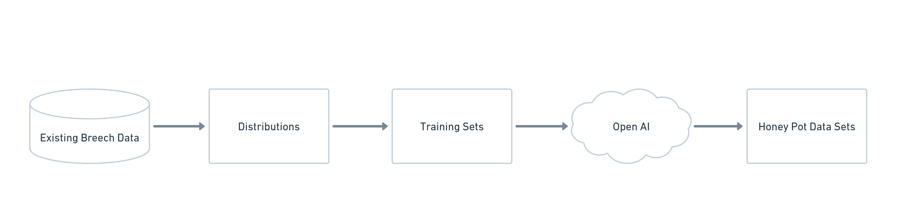
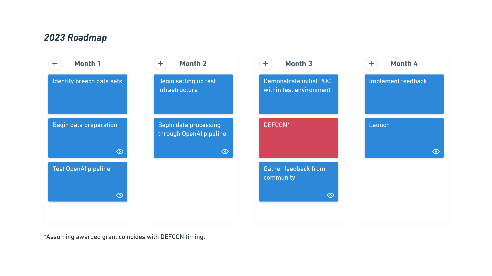

# PROJECT DETAILS
Project Members: 
- Derek Burgess
- Lu Zhu

Email: contact@partialtransformations.com

Phone: +1 412 417 9435

URL: partialtransformations.com

# SUMMARY
Cake Metrics is a toolset/framework for creating honeypot data sets. Blue Teams would maintain this as a component of their CI/CD and/or IT Security Tooling. Leveraging the traits of existing breeched data to create training sets that can be ingested by OpenAI to increase the deception of the honey pot. Additionally, the potential to increase deception through the use of AI has other use-cases, like obfascation, we intend to explore.

# HYPOTHESES
The concept of a honey pot within the context of Cybersecurity is not new, however, because the cost of creating sudo-realistic honey pots is high, honey pots rarely see deployment- We posit that ML/AI could be applied to the creation of both honey pot training data as well as the honey pot data sets themselves, reducing the resources (time & cost), and increasing their level of deception.  Blue Teams could buy themsevles time or trick attackers by deploying realistic AI generated honeypot data sets.

## QUESTIONS WE SEEK TO ANSWER
- Can we create training sets from existing data, and what risks come with that?
- Can we create training sets from distributions assisted by OpenAI?
- Can we generate realistic looking honey pots from our training sets and OpenAI?
- Which training sets perform better at generating realistic Honey Pots?
- Where in a defenders system does this tool best live?
- What alterantive use-cases exist?
- Can an attacker use these honey pots against the defenders?
- How can we validate real data from a realistic honey pot?
- Can we obfascate data sets using honey pots?

# APPROACH
We will begin by collecting various existing data sets from known security breeches. We will process these data sets through a combination of OpenAI API and statics tooling to produce an array of distrubtions that represent the traits that make up realistic looking data sets. From here, we will ingest these transformed data sets and produce Honey Pot data sets for placement within an defenders infrastrcutre.

## DIAGRAM

## NON BREECH DATA
Using breech data, even if left in a public place like Pastbin, is still a huge risk and could be considered unethical by many. A longer but purely AI based approach could be to isolate the traits as individual efforts and create data sets for each- Working with OpenAI, each trait could be developed to a point that when combined into a final data set, looks like a realistic database.

## DIAGRAM

## USE OF OPEN AI
Catagorize and label existing data sets and assit in the generation of honey pots. OpenAI would also remain part of the toolset, as we seek to provide defneders with the tooling and documentaton to spin this service up and create their own tailored honey pots.

## TESTING ENVIRONMENT
We will seek to create a simplified but realistic testing environment modeled on Blue Team principals. We will use descrete methods of capturing logs to demonstrate how an attacker would interact with the honey pot and leave behind evidence of that activity. We would also like to open the test environment to public attack for the purpose of improving on the honey pots and the infrastructure. We have not specified in the diagram below how we intend to implement our solution against the CI/CD pipeline and that is because we are resevering time during our testing to idenfity where and how this toolset can be injected into infrasturcture.

## DIAGRAM

# TIMELINE AND BUDGET
## Please describe how the funds will be used for your project, and outline how you arrived at the value *
If we use GPT4, at the current cost per 1000/tokens- if we ingest breeched data sets that look roughly like 2 billion tokens (~75 columns x 20-30 million records on average), then we would need ~$120,000 per data set to process it through the OpenAI API. If we use GPT3.5-turbo, at the current cost per 1000/tokens, we can bring the cost down to $4000 per data set.

We would approach this by not ingesting large data sets each time, but instead reviewing data set scheme and testing smaller chunks of data sets to determine viabiliy and furth reduce the overall cost.

Aside from using OpenAI credits for the usecases describe above, we will also need funding to spin up infrastructure that mimics a traditional defenders "Environment". This will help us validate the approach and demonstrate how this toolset can be used in practice by provide examples and documentation that would support licensing or public release.

Therefore we estimate that we would need roughly $25,000 -- $20,000 of which could be OpenAI credits, to cover the costs of processing up to 5 large data sets using GPT3.5-turbo and $5000 to cover the cost of the setup/maintainence of our testing infrastructure (~$1,000 upfront with variable cloud costs).

## Please provide a roadmap for the project on a one year time horizon*

# THE TEAM
## Derek Burgess
With 15 years of experience across IT. Derek leads clients through the challenges of digital transformation concerning data, privacy, and security. Having worked a wide range of relevant roles across; Help Desk, Product Design, Product Management, and Engineering, Derek has always pushed to introduce more data-driven techniques to those practices, while partnering across disciplines to design tooling and automation that empower teams to become more data-driven.

## WHY US
Derek and Lu first met working together on an internal tool that analyzed real time data from manufacutirng facilities and provided real time scheduling & production insights back to operators, managers, and other automation tools up/down stream.

For Derek, he has always had an interest in Cybersecurity and even prior to the current advent of Consumer AI, has been part of the Pwnagotchi/Bettercap communities, as well as endevors to create distributed ML processing of WPA encryption. He currently also consults for Fueled, a digital agency, where he guides clients through data/analytics strategy and implementations.